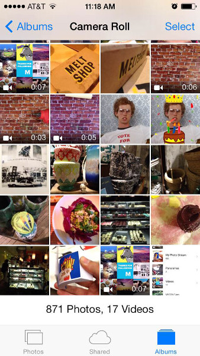
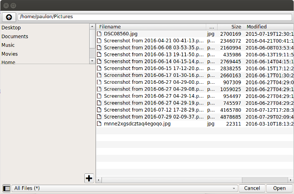

The goal of quick native is to provide native user experience in components that require a fine integration in both Android and IOS. Also, this library is inspired by how [RectNative](http://www.reactnative.com) extensions work which briefly means to provide an abstracted interface that's platform independent.

One of the main reasons to use QML/Qt is the fact that apps don't need to run in their target platform all the time (through emulators or physical devices), instead they can be executed locally which makes the process of writing mobile apps very convenient, therefore components in this library fallback to Qt's standard ones when the running platform does not have the equivalent native one.

### Native Components
Component | Native Android | Native IOS | Desktop |
--- | --- | --- | --- |
NativeFileDialog | Provided By QuickNative | Native component provided by Qt | Provided By Qt |
NativeTextInput | *coming soon* | *coming soon* | *coming soon* |

### Examples


#### Image Picker (NativeFileDialog)
* This component has been successfully tested accross different android versions and devices
* Follows the same api as [FileDialog](http://doc.qt.io/qt-5/qml-qtquick-dialogs-filedialog.html):

```javascript

import QuickNative 0.1

...

NativeFileDialog {
    selectMultiple: true
    folder: shortcuts.pictures

    Component.onCompleted: {
        open()
    }

    onFileUrlsChanged: {
        console.log(fileUrls)
    }
}

...

```

#### Result:

Android | IOS | Desktop
--- | --- | --- |
 |  | 


### Installation

This library is available through [qpm](https://www.qpm.io):

    qpm install com.paulon.quicknative


### Licensing
QuickNative is free software; you can redistribute it and/or modify it under the terms of the MIT License

